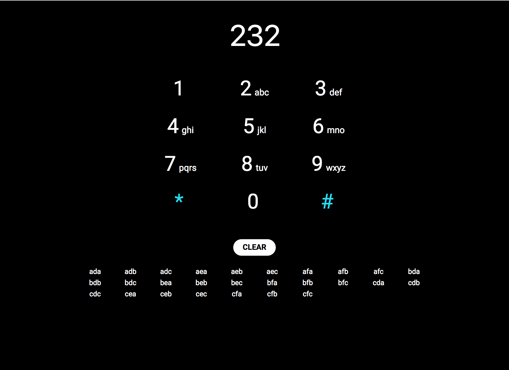

## Dependencies
  - [node.js](https://nodejs.org) `v7.9.0`
  - [npm](https://www.npmjs.com) `~5.3.0`

## Setup
```
npm install
```

## Running the app
- `npm start` will build assets and run the app at `http://127.0.0.1:5500/`
- `npm test` will run the jest test runner
